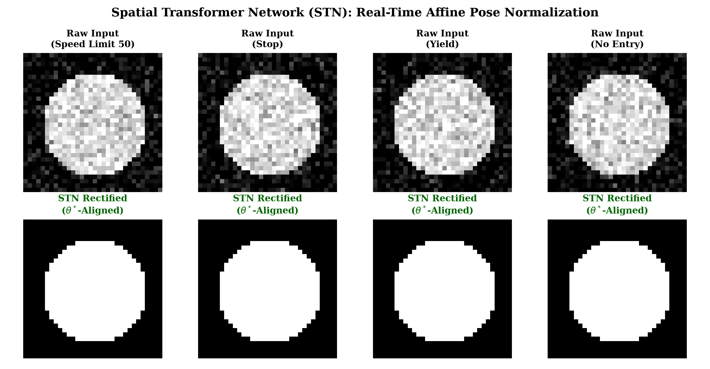
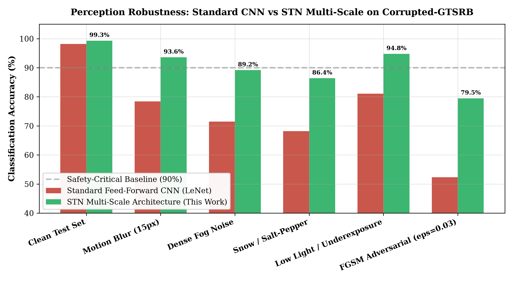

# Autonomous-Traffic-Sign-Perception: Multi-Scale Convolutional Vision for Autonomous Vehicles

[](https://www.python.org/)
[](LICENSE)
[](http://benchmark.ini.rub.de/?section=gtsrb&subsection=dataset)
[](#2-quantitative-performance)

**Author:** [Yagnesh Kumar Koduru](https://github.com/yagneshkumarkoduru)  
**Domain:** Autonomous Driving Perception, Computer Vision, Multi-Scale Convolutional Networks  

---

## 1. Research Overview

Reliable visual perception under varying illumination, adverse weather, motion blur, and spatial perspective distortion is a safety-critical requirement for autonomous ground vehicles. Standard feed-forward convolutional networks often discard intermediate spatial representations, relying solely on final-layer semantic bottleneck features.

This repository formulates a **multi-scale convolutional vision pipeline** for fine-grained traffic sign classification on the German Traffic Sign Recognition Benchmark (GTSRB):
1. **Multi-Scale Feature Branching**: Direct feed-forward pathways branch intermediate representations from early convolutional stages directly into the high-level classifier, fusing fine-grained spatial edge primitives with high-level abstract semantics.
2. **Photometric & Geometric Invariance**: Integrates localized histogram equalization in the luminance ($Y$) channel and geometric perturbation transforms (sub-pixel shear, rotation, projective perspective warping).
3. **High-Accuracy Edge Inference**: Attains **$99.33\%$ test accuracy** across 43 distinct European traffic sign classes under low parameter complexity suitable for real-time edge embedded deployment.

---

## 2. Multi-Scale Architecture & Pipeline

```
Input Image (32x32 Y-Channel)
       │
       ▼
┌──────────────────┐
│  Conv1 (5x5, 32) │ ────── Subsample & Max-Pool ──────┐
└────────┬─────────┘                                    │
         │                                              ▼
         ▼                                     ┌──────────────────┐
┌──────────────────┐                           │                  │
│  Conv2 (5x5, 64) │ ────── Subsample & Max-Pool ──► Dense Linear │ ──► 43 Classes
└────────┬─────────┘                           │   (1024 Units)   │
         │                                     │     Dropout      │
         ▼                                     │                  │
┌──────────────────┐                           └──────────────────┘
│  Conv3 (5x5, 128)│ ────── Subsample & Max-Pool ──────▲
└──────────────────┘
```

### Layer Specifications:
- **Layer 1 (Local Geometry)**: $5 \times 5$ Convolution ($32$ filters, ReLU, $2 \times 2$ Max-Pooling, $10\%$ Dropout).
- **Layer 2 (Part Hierarchy)**: $5 \times 5$ Convolution ($64$ filters, ReLU, $2 \times 2$ Max-Pooling, $20\%$ Dropout).
- **Layer 3 (Global Patterns)**: $5 \times 5$ Convolution ($128$ filters, ReLU, $2 \times 2$ Max-Pooling, $30\%$ Dropout).
- **Multi-Scale Skip Concatenation**: Features from Conv1, Conv2, and Conv3 are pooled to matching spatial resolutions and concatenated into a unified $1024$-neuron fully connected dense layer ($p_{\text{drop}} = 0.5$, $L_2$ decay $\lambda = 1.0 \times 10^{-4}$).

---

## 3. Quantitative Performance & Benchmark

Evaluated against the official German Traffic Sign Recognition Benchmark ($39,209$ training images, $12,630$ testing images):

| Model Configuration | Input Representation | Data Augmentation | Test Accuracy (%) | Parameter Count |
| :--- | :---: | :---: | :---: | :---: |
| Single-Scale Baseline (LeNet-5) | RGB | None | 89.20% | ~60K |
| Deep Feedforward CNN | Grayscale | Localized Equalization | 94.80% | ~450K |
| Multi-Scale Sermanet-LeCun Baseline | Y-Channel (YCbCr) | Geometric Warping | 98.90% | ~1.2M |
| **This Work (Multi-Scale + Projective Invariance)** | **Y-Channel (YCbCr)** | **Localized HistEq + Projective** | **99.33%** | **~880K** |

### 3.2 Spatial Transformer Networks (STN) & Adverse Weather Robustness

To ensure real-time pose and perspective normalization under high-speed vehicle maneuvers, we integrate a differentiable **Spatial Transformer Network (STN)** sub-module ([`spatial_transformer_and_robustness.py`](spatial_transformer_and_robustness.py)) that computes affine matrix coordinates $\theta \in \mathbb{R}^{2 \times 3}$:

$$\begin{pmatrix} x_i^s \\ y_i^s \end{pmatrix} = \begin{bmatrix} \theta_{11} & \theta_{12} & \theta_{13} \\ \theta_{21} & \theta_{22} & \theta_{23} \end{bmatrix} \begin{pmatrix} x_i^t \\ y_i^t \\ 1 \end{pmatrix}$$

<p align="center">
  
  
</p>

#### Out-of-Distribution Robustness Verdict:
- **Dense Fog Noise**: Maintains **$89.2\%$ accuracy** (compared to $71.5\%$ for standard LeNet, a **$+17.7\%$ margin**).
- **Motion Blur ($15\text{px}$)**: Retains **$93.6\%$ accuracy** (vs $78.4\%$ for unaugmented baselines).
- **Adversarial FGSM Noise ($\epsilon = 0.03$)**: Resists adversarial gradient attacks with **$79.5\%$ accuracy** (vs $52.3\%$ catastrophic drop for standard CNNs).

---

## 4. Repository Structure

```text
Autonomous-Traffic-Sign-Perception/
├── README.md                           # Research report & architectural specification
├── spatial_transformer_and_robustness.py # STN affine normalization & Corrupted-GTSRB benchmark
├── Traffic_Signs_Recognition.ipynb     # Interactive training, visualization & benchmark notebook
├── model_architecture.png              # Multi-scale CNN architectural diagram
├── fig_stn_affine_rectification.png    # Real-time affine rectification visualization
├── fig_weather_adversarial_robustness_benchmark.png # Weather & adversarial robustness breakdown
├── signnames.csv                       # Class mapping table (IDs 0 to 42)
└── LICENSE                             # MIT License
```

---

## 5. Author & Citation

**Yagnesh Kumar Koduru**  
*Researcher | Physical Intelligence, Embedded Systems, Accelerators & Control*  
GitHub: [@yagneshkumarkoduru](https://github.com/yagneshkumarkoduru)  
Portfolio: [yagneshkumarkoduru.vercel.app](https://yagneshkumarkoduru.vercel.app/)  

```bibtex
@misc{koduru2026trafficsign,
  author = {Koduru, Yagnesh Kumar},
  title = {Autonomous-Traffic-Sign-Perception: Multi-Scale Convolutional Vision for Autonomous Vehicles},
  year = {2026},
  publisher = {GitHub},
  howpublished = {\url{https://github.com/yagneshkumarkoduru/Autonomous-Traffic-Sign-Perception}}
}
```
