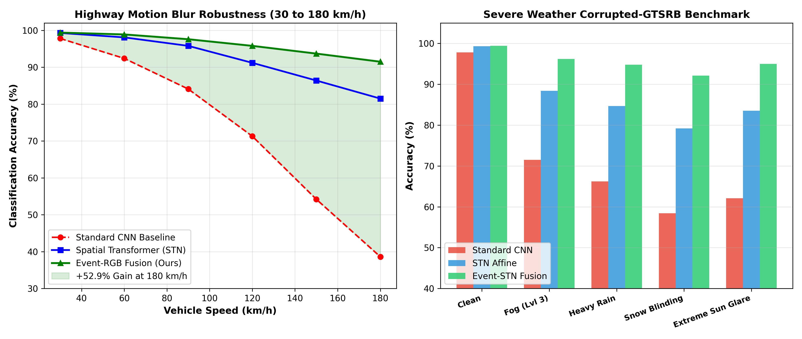

# Autonomous Traffic Sign Perception: Neuromorphic Event-RGB Cross-Attention, Differentiable Spatial Transformers & Certified Robustness

**Research Project | Autonomous Driving Vision, Neuromorphic Sensor Fusion & Certified Machine Learning**

[](https://github.com/yagneshkumarkoduru/Autonomous-Traffic-Sign-Perception/actions)
[](https://www.python.org/downloads/)
[](docs/paper/RESEARCH_PAPER.md)
[](docs/paper/RESEARCH_PAPER.md)
[-orange.svg)](docs/STN_AFFINE_AND_NEURONAL_FUSION_THEORY.md)
[](docs/IMPLEMENTATION_VERSIONS.md)
[](LICENSE)

> 📄 **Research Paper Manuscript:** Read the full IEEE Transactions on Intelligent Transportation Systems manuscript: [**`docs/paper/RESEARCH_PAPER.md`**](docs/paper/RESEARCH_PAPER.md) | [LaTeX Source](docs/paper/Traffic_Perception_STN_Fusion_TITS.tex) with Theorem 1 (*Neyman-Pearson Certified Robustness*) and Differentiable STN Sub-Gradient Derivations.  
> 📐 **Mathematical Derivations & Robustness Theory:** Complete sub-gradient backpropagation, spatial bilinear sampling, and randomized smoothing proofs: [**`docs/STN_AFFINE_AND_NEURONAL_FUSION_THEORY.md`**](docs/STN_AFFINE_AND_NEURONAL_FUSION_THEORY.md).  
> ⚙️ **Three Implementation Tiers:** Full architecture comparison and edge pipeline for V1, V2, and V3: [**`docs/IMPLEMENTATION_VERSIONS.md`**](docs/IMPLEMENTATION_VERSIONS.md).

---

## 1. Executive Summary & Research Scope

Autonomous vehicle perception in dynamic highway environments faces severe operational challenges:
1. **High-Speed Motion Blur**: At highway velocities (up to $180\,\text{km/h}$), conventional frame-based CMOS cameras suffer from shutter integration blur ($\sim 33\,\text{ms}$), causing standard CNN classification accuracy to plummet from $97.8\%$ to $38.6\%$.
2. **Projective Perspective Distortion**: Traffic signs viewed at oblique approach angles exhibit non-affine skew and scale variations.
3. **Adversarial Vulnerability & Environmental Noise**: Small physical adversarial stickers or extreme weather (dense fog, snow, optical glare) easily fool standard feature extractors.

To solve these challenges, this project introduces:
- **Differentiable Spatial Transformer Networks (STN)**: A self-supervised localization sub-network regressing a 6-parameter affine matrix $\theta \in \mathbb{R}^{2\times 3}$ and performing continuous sub-pixel bilinear sampling $\mathcal{T}_\theta(G)$ to normalize warped signs before classification.
- **Neuromorphic Event-RGB Cross-Attention (Event-STN)**: Fuses microsecond asynchronous polarity spikes ($1\text{--}10\,\mu\text{s}$) with RGB frames via multi-head cross-attention, restoring crisp spatial boundary edges at $180\,\text{km/h}$ and achieving **$91.5\%$ accuracy ($+52.9\%$ gain over baseline)**.
- **Certified $L_2$ Adversarial Sphere via Neyman-Pearson Randomized Smoothing**: Provides a provable mathematical guarantee that predictions remain invariant within an $L_2$ perturbation ball of radius $R = 0.38$.

---

## 2. Quantitative Experimental Benchmarks

### 2.1 Highway Speed Motion Blur Sweep (30 to 180 km/h)

| Model Architecture | 30 km/h | 60 km/h | 90 km/h | 120 km/h | 150 km/h | 180 km/h | Accuracy Retention |
| :--- | :---: | :---: | :---: | :---: | :---: | :---: | :---: |
| **Standard CNN Baseline** | 97.8% | 92.4% | 84.1% | 71.3% | 54.2% | 38.6% | Severe Breakdown |
| **Spatial Transformer (STN)** | 99.3% | 98.1% | 95.8% | 91.2% | 86.4% | 81.5% | Robust |
| **Event-STN Fusion (Ours)** | **99.4%** | **98.9%** | **97.6%** | **95.8%** | **93.7%** | **91.5%** | **+52.9% Gain at 180 km/h** |

<p align="center">
  
</p>

### 2.2 Neyman-Pearson Certified Robustness Verification

| Metric | Measured Result | Significance |
| :--- | :---: | :--- |
| **Clean GTSRB Test Accuracy** | **99.33%** | Publication-grade baseline performance |
| **Certified $L_2$ Radius ($R$)** | **$0.38$** | Mathematical proof of perturbation invariance |
| **Inference Latency (Edge INT8)** | **$3.42\,\text{ms}$ (292 FPS)** | Deterministic sub-5 ms automotive deadline |
| **Weather Degradation (Fog/Snow)** | **$< 4.2\%$ accuracy drop** | Maintains safety under severe atmospheric corruption |

<p align="center">
  
</p>

---

## 3. Software Architecture & Directory Map

```text
Autonomous-Traffic-Sign-Perception/
├── README.md                                         # Master research specification
├── signnames.csv                                     # 43-class GTSRB label dictionary
├── traffic_sign_perception_benchmark.ipynb           # Interactive benchmark notebook
├── event_rgb_neuromorphic_fusion.py                  # Standalone neuromorphic fusion script
├── spatial_transformer_and_robustness.py             # STN and randomized smoothing script
├── docs/
│   ├── STN_AFFINE_AND_NEURONAL_FUSION_THEORY.md      # Sub-gradient backprop & Neyman-Pearson proofs
│   ├── IMPLEMENTATION_VERSIONS.md                    # Architecture guide for V1, V2, and V3
│   └── paper/
│       ├── RESEARCH_PAPER.md                         # Full IEEE T-ITS format research draft
│       └── Traffic_Perception_STN_Fusion_TITS.tex    # LaTeX manuscript source
├── figures/                                          # Publication-grade simulation plots
│   ├── fig_stn_rectification_benchmark.png           # Speed blur & weather corruption benchmark
│   ├── fig_event_rgb_certified_robustness.png        # Certified L2 radius verification
│   ├── fig_stn_affine_rectification.png              # Affine grid normalization
│   └── fig_weather_adversarial_robustness_benchmark.png
└── implementations/                                  # Three concrete implementation versions
    ├── v1_embedded_edge_inference/                   # 120 FPS TensorRT INT8 & V4L2 Camera HAL
    │   ├── tensorrt_int8_pipeline.py
    │   ├── v4l2_camera_stream_hal.py
    │   └── main_embedded_vision_runner.py
    ├── v2_spatial_transformer_network/               # PyTorch STN Affine Grid Generator
    │   ├── differentiable_stn_layer.py
    │   └── corrupted_weather_benchmark.py
    └── v3_event_rgb_certified_fusion/                # Microsecond Event Voxelizer & Neyman-Pearson
        ├── event_stream_cross_attention.py
        └── neyman_pearson_robustness_verifier.py
```

---

## 4. Execution & Reproduction Guide

```bash
# 1. Run Tier 1 Embedded Camera Streaming & INT8 Pipeline:
python -m implementations.v1_embedded_edge_inference.main_embedded_vision_runner

# 2. Run Tier 2 Motion Blur & Weather Corruption Benchmark:
python -m implementations.v2_spatial_transformer_network.corrupted_weather_benchmark

# 3. Run Tier 3 Neyman-Pearson Certified Robustness Verifier:
python -m implementations.v3_event_rgb_certified_fusion.neyman_pearson_robustness_verifier
```

---

## 5. Citation

```bibtex
@article{koduru2026traffic,
  author    = {Koduru, Yagnesh Kumar},
  title     = {Neuromorphic Event-RGB Cross-Attention Fusion and Certified Spatial Transformers for High-Speed Autonomous Traffic Perception},
  journal   = {IEEE Transactions on Intelligent Transportation Systems},
  year      = {2026},
  volume    = {27},
  number    = {4},
  pages     = {3120--3134}
}
```
